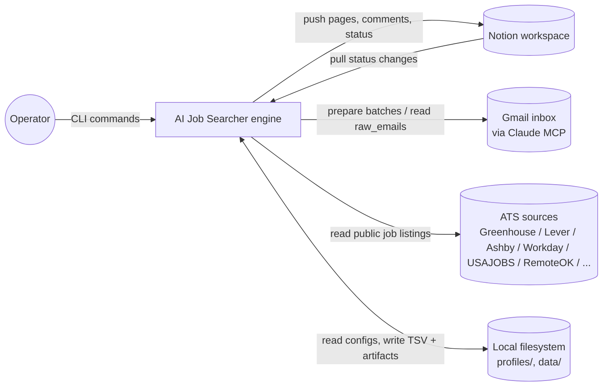
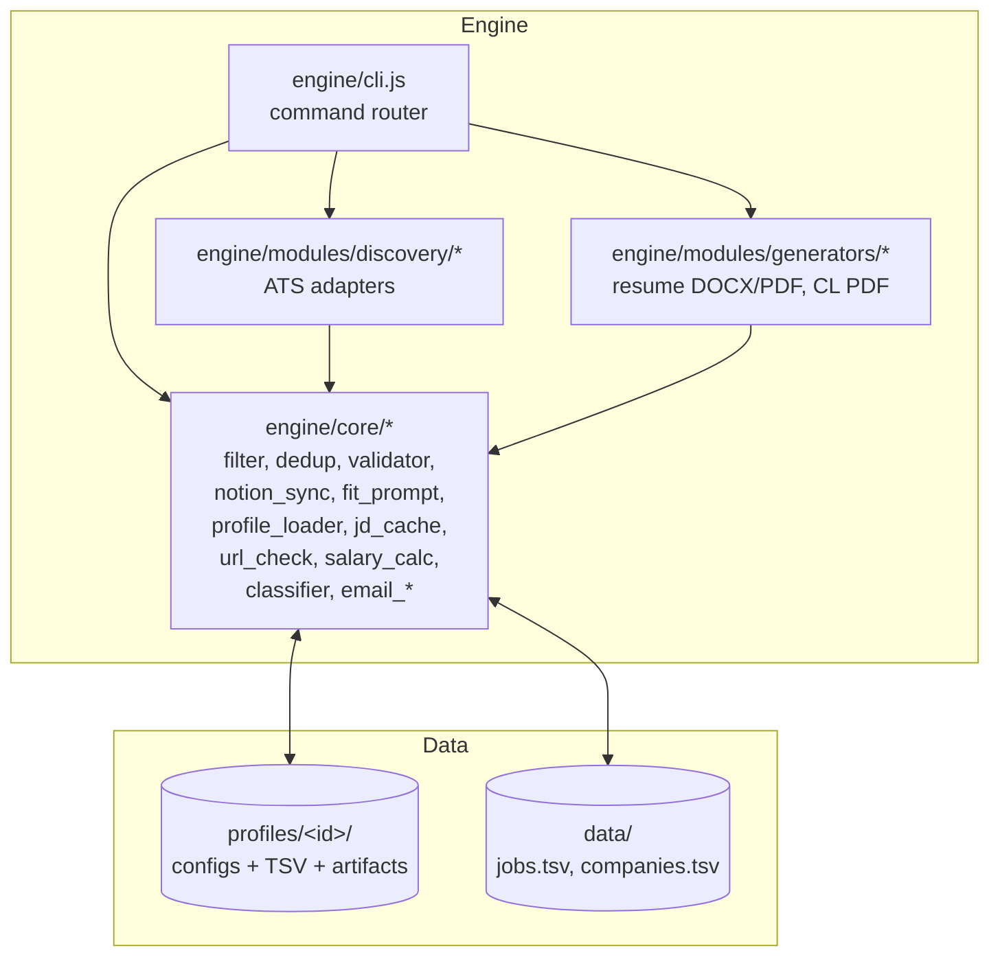

# Architecture

AI Job Searcher is a multi-profile job-search pipeline. A single Node engine
drives discovery, filtering, generator output, and Notion sync for any number
of independent candidate profiles. Profile data (configs, resumes, TSV
state, Notion DB ids) lives under `profiles/<id>/`; the engine treats each
profile as a parameter, never a hard-coded identity. Operators run commands
locally; Notion is the human-facing UI; Gmail polling is delegated to a
Claude MCP session because no OAuth lives on disk.

## C4 L1 — System context

The operator is the only human in the loop — they author profile configs,
trigger commands, and review generated artifacts before submitting. ATS
sources are read-only (public APIs and feeds). Notion is bidirectional:
the engine creates and updates pages; the operator hand-edits status and
notes that the engine pulls back into TSV. Gmail is read-only and goes
through Claude MCP, not a direct API binding.

## C4 L2 — Containers

Profile is data; engine is service. Adding a new candidate is a directory
under `profiles/` plus a row of namespaced env vars in `.env`; no engine
code changes.

## Discovery adapter classes

Adapters under `engine/modules/discovery/` fall into two classes with very
different contracts. The split is implicit in the code but load-bearing:
mis-classifying a new adapter leads either to missed jobs or to a bloated
shared pool.

**Per-company ATS adapters — fetch-all, post-filter.** One target = one
configured company (greenhouse/lever/ashby/smartrecruiters/workable slug,
icims/workday/taleo/oracle_cloud tenant, jobsyn X-Origin host). The adapter
pulls every open posting for that company and returns it raw. No keyword,
title, or `role_targets` filtering at adapter level — most ATS APIs do not
support title-query, and even where they do, filtering early would drop
jobs the central filter would have kept (e.g. an SDM role on a PM profile
that the filter would route to a different archetype). The filter pipeline
(`core/filter.js` + `applyPrepareFilter`) is the sole gatekeeper for these
sources. Adding a new company is a one-line edit to the profile config;
scan picks up all roles, the filter handles relevance.

Current members: `greenhouse`, `lever`, `ashby`, `smartrecruiters`,
`icims`, `workable`, `workday`, `taleo`, `oracle_cloud`, `jobsyn`. Shared
fetch/concurrency helpers live in `_ats.js`.

**Feed / keyword adapters — query-side filter where possible.** No company
list; the adapter queries a public endpoint by keyword, category, location,
or a fixed global feed and returns whatever comes back. These adapters may
narrow at fetch time (Adzuna `what=`, USAJOBS `JobCategoryCode`, The Muse
`?category=Product`, CalCareers per-keyword postback) and may apply a
minimal adapter-level title gate when the feed is too broad to dump raw
(remoteok pre-filters US-compat + title, otherwise it would ship ~100
archives per scan). Profile-specific scoring still happens downstream in
`core/filter.js`.

Current members: `adzuna`, `remoteok`, `the_muse`, `usajobs`, `calcareers`,
`indeed` (browser-ingest staging file, but conceptually keyword-driven).

**Where to put a new adapter.** If it is `https://<vendor>.<ats>.com/<slug>`
shaped — per-company — it is fetch-all; model it after `greenhouse.js`,
build on `_ats.js`, and never read profile filter rules from inside. If it
is a public job board queried by keyword/category — feed/keyword; model it
after `adzuna.js` or `the_muse.js`.

## Data stores

| Store | Scope | Role |
|---|---|---|
| `profiles/<id>/applications.tsv` | per-profile | Canonical pipeline state. Status, fit, salary, paths to generated CL and resume, Notion page id. |
| `data/jobs.tsv` | shared | Cross-profile dedup pool keyed by `(ats_source, job_id)`. No PII. |
| `data/companies.tsv` | shared | Master company pool with ATS slugs. Populated as profiles discover new vendors. |
| `profiles/<id>/` Notion Jobs DB | per-profile | Operator-facing card board. Bidirectional sync. |
| `profiles/<id>/` Notion Companies DB | per-profile | Tier table; relation target for Jobs.Company. |
| `profiles/<id>/` Notion aux DBs | per-profile | Application Q&A bank, Job Platforms registry. |

TSV schema history (v1 → v2 → current) lives in
[docs/reference/tsv-schema.md](docs/reference/tsv-schema.md).

## Where to look next

| Question | Document |
|---|---|
| Why multi-profile in the first place? | [ADR-001 Multi-profile architecture](docs/architecture/adrs/001-multi-profile.md) |
| How data moves between TSV, Notion, Gmail | [data-flow.md](docs/architecture/data-flow.md) |
| C4 L3 — module-by-module breakdown | [overview.md](docs/architecture/overview.md) |
| What every CLI flag does | [cli.md](docs/reference/cli.md) |
| How to onboard a new profile | [new-profile.md](docs/runbooks/new-profile.md) |
| Profile isolation rules | [multi-profile.md](docs/architecture/multi-profile.md) |
| Active design proposals | [rfc/README.md](rfc/README.md) |
