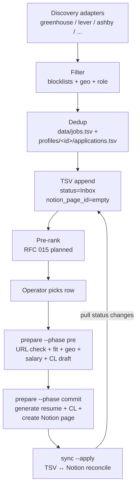
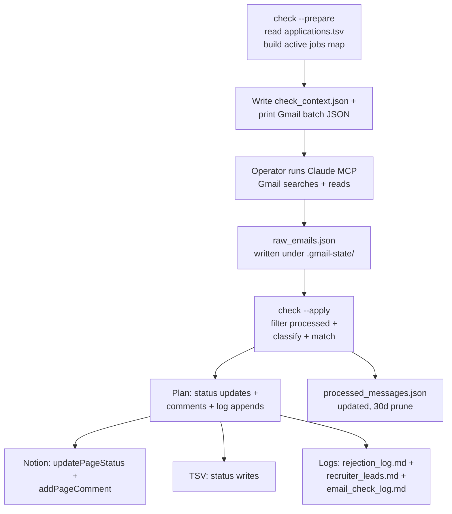

# Data flow

This document traces data through the two pipelines the engine runs:
discovery-to-apply (the main loop) and email-check (reactive). For
component-by-component module detail, see [`overview.md`](overview.md).
For container and system context, see
[`../../ARCHITECTURE.md`](../../ARCHITECTURE.md).

## Pipeline 1 — Discovery to apply

Steps in detail:

1. **Discovery**. Each enabled adapter fetches its source and emits
   normalized job records in memory. No filesystem writes yet.
2. **Filter**. `engine/core/filter.js` applies the profile's
   `filter_rules.json` (title / company / location blocklists). The
   US-marker safeguard suppresses location blocklist when the JD asserts
   "United States".
3. **Dedup**. `engine/core/dedup.js` checks `(ats_source, job_id)`
   against the shared `data/jobs.tsv` and the profile's
   `applications.tsv`. Survivors are appended to `data/jobs.tsv`.
4. **TSV append**. Fresh rows go to `profiles/<id>/applications.tsv`
   with `status="Inbox"` and `notion_page_id=""`. `Inbox` is a
   TSV-only staging status; it never appears in Notion. See
   [RFC 014](../../rfc/014-status-split-new-vs-toapply.md) for the
   status semantics. `prepare --phase commit` is what transitions
   `Inbox → To Apply` (when the operator decides to apply) or
   `Inbox → Archived` (when filtered out).
5. **Pre-rank** (planned, [RFC 015](../../rfc/015-fit-prerank.md)). Bulk
   fit scoring over all unprepared rows so the operator triages by score
   instead of recency.
6. **Prepare**. Operator picks a row. `prepare --phase pre` runs the
   live URL check (`url_check.js`), composes the fit prompt
   (`fit_prompt.js`), pulls the JD through `jd_cache.js` if available,
   computes salary (`salary_calc.js`), enforces geo
   (`geo_enforcer.js`), and writes a `results.json` plan to
   `profiles/<id>/.prepare-state/`. Operator approves; `prepare --phase
   commit` generates resume + cover letter, calls
   `notion_sync.createJobPage`, resolves the Company relation through
   `company_resolver.js`, and writes the artifact paths back into TSV.
7. **Sync**. `sync --apply` reconciles TSV with the Jobs Pipeline DB.
   Push side honors `.stage16/push_manifest.json` if present. Pull side
   reads operator-side status edits from Notion and writes them back to
   TSV.

## Pipeline 2 — Email check (two-phase MCP)

Steps in detail:

1. **`check --prepare`**. Loads `applications.tsv`, computes the cursor
   epoch (saved `last_check`, clamped to 30 days; or `--since`), builds
   an active-jobs map (status in `{Applied, To Apply, Phone Screen,
   Onsite, Offer}` and `notion_page_id` set), and writes
   `profiles/<id>/.gmail-state/check_context.json`. Prints the Gmail
   batch JSON to stdout — 10 companies per company-batch plus fixed
   batches for LinkedIn alerts and recruiter outreach.
2. **Operator (Claude MCP)** runs Gmail searches and reads, writes the
   results to `profiles/<id>/.gmail-state/raw_emails.json` in the shape
   `[{messageId, threadId, from, subject, body, date}, ...]`.
3. **`check --apply`** (or dry-run default) reads context plus
   `raw_emails.json`, filters already-processed messages, branches per
   email:
   - **LinkedIn alert**: parse → dedup against TSV → append a
     `To Apply` row or skip.
   - **Recruiter outreach**: parse role → either a `To Apply` row or a
     `recruiter_leads.md` entry.
   - **Normal**: classify (`classifier.js`) and match
     (`email_matcher.js`); branch on the type:

     | Classifier type | New status | Notion comment |
     |---|---|---|
     | `REJECTION` | `Rejected` | rejection comment + `rejection_log.md` |
     | `INTERVIEW_INVITE` | `Interview` (per Stage 8 unification) | invite comment |
     | `INFO_REQUEST` | unchanged | info-request comment |
     | `ACKNOWLEDGMENT` / `OTHER` | unchanged | none |

     Skip rule: rows already in `Rejected` or `Closed` are not touched.
4. **Persistence**. With `--apply`, the engine calls Notion via
   `updatePageStatus` and `addPageComment`, writes status changes to
   TSV, appends the three log files, and updates
   `processed_messages.json` (append message ids, bump `last_check`,
   prune entries older than 30 days).

For background on why this is two-phase MCP rather than direct OAuth,
see [RFC 002](../../rfc/002-check-command.md). The autonomous OAuth
variant is tracked in
[RFC 005](../../rfc/005-gmail-cron-autonomous-check.md) and feeds into
[RFC 016 — Unified JD cache](../../rfc/016-unified-jd-cache.md) for the
storage layer it would share.
